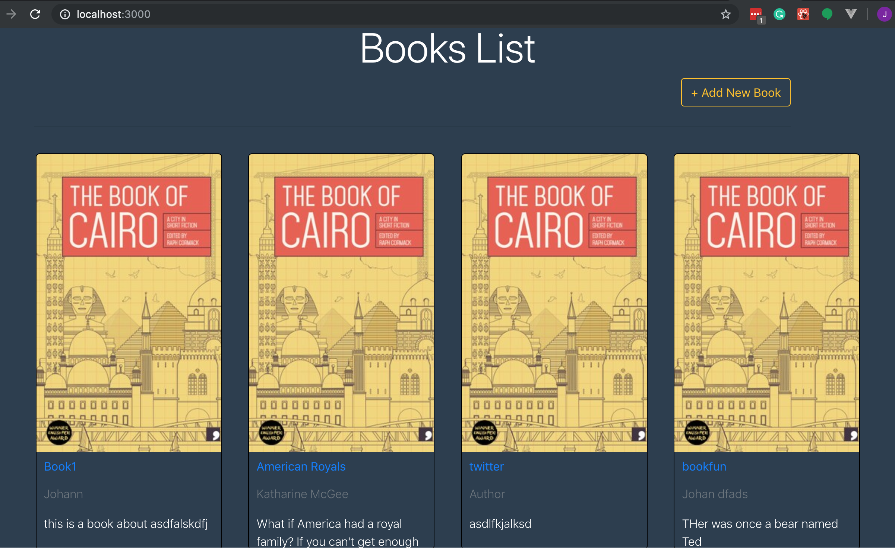

# MERN-BOOK-APP

## Followed Tutorial: https://blog.logrocket.com/mern-stack-a-to-z-part-1/

## Backend Portion
- Mongo Express Node

## Instructions to Run App
- Run frontend AND backend to enable working app.
- **The below is to run backend portion**
- Npm install
- Setup Database and create Config folder (refer to tutorial)
- "node app.js" to run (runs on localhost:8082)
- Then run frontend portion
